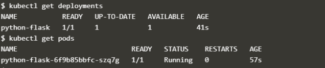
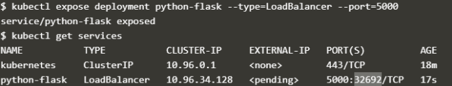
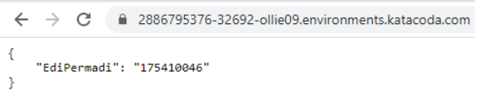

# UAS 

### Nama  : Edi Permadi  
### NIM  : 175410046

# 1. Membuat Image  

Membuat Image dengan nama edipermadi99/edipermadi:v1

- Dockefile

        FROM python:2.7  
        COPY . /app
        WORKDIR /app
        RUN pip install -r requirements.txt
        ENTRYPOINT ["python"]
        CMD ["app.py"]
- app.py

        from flask import Flask
        from flask_restful import Resource, Api

        app = Flask(__name__)
        api = Api(app)

        class HelloWorld(Resource):
            def get(self):
                return {'EdiPermadi': '175410046'}

        api.add_resource(HelloWorld, '/')

        if __name__ == '__main__':
            app.run(debug=True, host='0.0.0.0')

- requirements.txt

        flask
        flask_restful

# 2. Menjalankan di Kubernetes  

a. Membuat deployment untuk image edipermadi  

    $ kubectl create deployment phyton-flask --image=edipermadi99/edipermadi:v1
    deployment.apps/phyton-flask created

b. Membuat service untuk meng-expose port 5000 image phytonn-flask  

    $ kubectl expose deployment phyton-flask --type=LoadBalancer --port=5000
    service/phyton-flask exposed

c. Melihat Service yang berjalan dan melihat service yang berjalan 

   
    
d. Melihat bahwa port 5000 di expose ke port 32181

e. Hasil  

